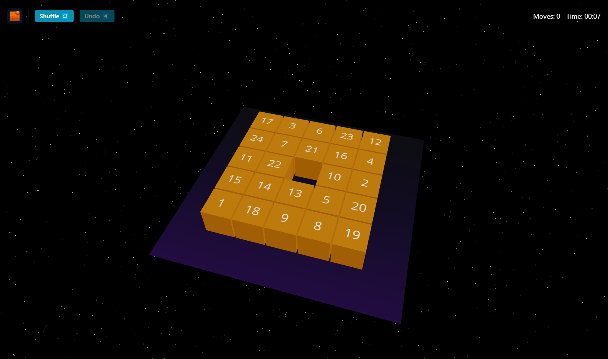

# SlideCube 3D

An infinite 3D sliding-tile puzzle built with Next.js, TypeScript, React Three Fiber, and TailwindCSS. Each playthrough generates a new random board, and you can choose the size or leave it random. Move, solve, and compete against yourself or challenge friends!



---

## 🚀 Features

- **3D Sliding Puzzle**  
  Boards of N×N (3×3, 4×4, 5×5, 6×6) generated with a random seed.
- **Smooth Interface**  
  Declarative rendering with React Three Fiber + Drei, smooth animations with react-spring.
- **Timer & Move Counter**  
  Track your speed and efficiency.
- **Undo & Shuffle**  
  Undo your last move or reshuffle at any time.
- **Share & Challenge**  
  Share your results and challenge others on the same board.
- **Static Deployment**  
  Built with `next export` for free hosting on Vercel.

---

## 📦 Tech Stack

- [Next.js](https://nextjs.org/)
- [TypeScript](https://www.typescriptlang.org/)
- [React Three Fiber](https://github.com/pmndrs/react-three-fiber)
- [@react-three/drei](https://github.com/pmndrs/drei)
- [TailwindCSS](https://tailwindcss.com/)
- [seedrandom](https://github.com/davidbau/seedrandom) (seeded PRNG)
- [react-spring/three](https://react-spring.io/) (optional, for animations)

---

## 📁 Folder Structure

```
├── components
│   ├── GameCanvas.tsx       # 3D scene and raycasting logic
│   └── UIControls.tsx       # Buttons, timer, and move counter
├── hooks
│   ├── usePuzzle.ts         # Board logic: generate, shuffle, undo
│   └── useTimer.ts          # Timer start/pause/reset
├── lib
│   └── puzzle.ts            # Pure functions: generate, shuffle, isSolved
├── pages
│   ├── index.tsx            # Landing with size selection and “Start New Game”
│   └── play.tsx             # Game page (header, canvas, modal)
├── public
│   └── logo.png             # Logo and favicon
├── styles
│   └── globals.css          # Tailwind directives
├── next.config.js
├── tsconfig.json
└── tailwind.config.js
```

---

## ⚙️ Installation & Scripts

1. Clone the repo
   ```bash
   git clone https://github.com/your-username/slidecube-3d.git
   cd slidecube-3d
   ```
2. Install dependencies
   ```bash
   npm install
   ```
3. Development mode
   ```bash
   npm run dev
   # http://localhost:3000
   ```
4. Build and export static site
   ```bash
   npm run build
   npm run export
   ```
5. Deploy the `out/` folder to Vercel or any static host.

---

## 🎨 Customization

- **Colors & Background**  
  Edit the `GalaxyPlane` component or the `GradientTexture` in `GameCanvas.tsx`.
- **Board Sizes**  
  Adjust the dropdown options in `pages/index.tsx`.
- **Animations**  
  Integrate `react-spring/three` in `GameCanvas` for cube transitions.

---

## 🤝 Contributing

Contributions welcome!

1. Fork the repo.
2. Create a feature branch (`git checkout -b feature/your-feature`).
3. Make your changes and commit.
4. Open a pull request.

---

## 📄 License

MIT License © 2025 SlideCube 3D

```markdown
MIT License

Copyright (c) 2025

Permission is hereby granted, free of charge, to any person obtaining a copy
...
```
